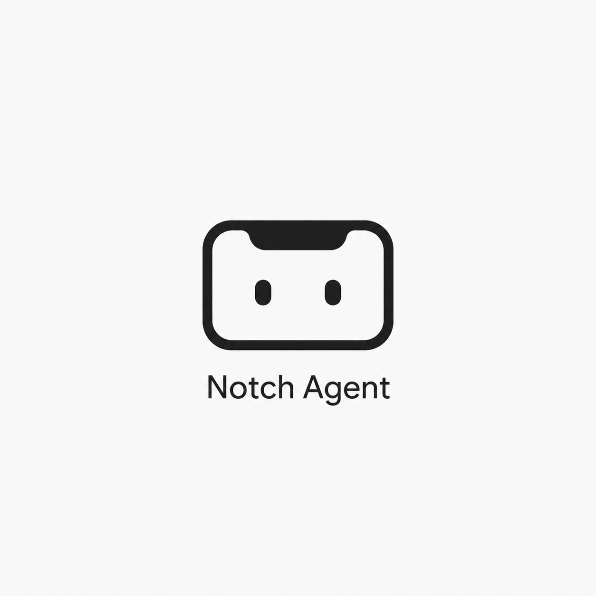
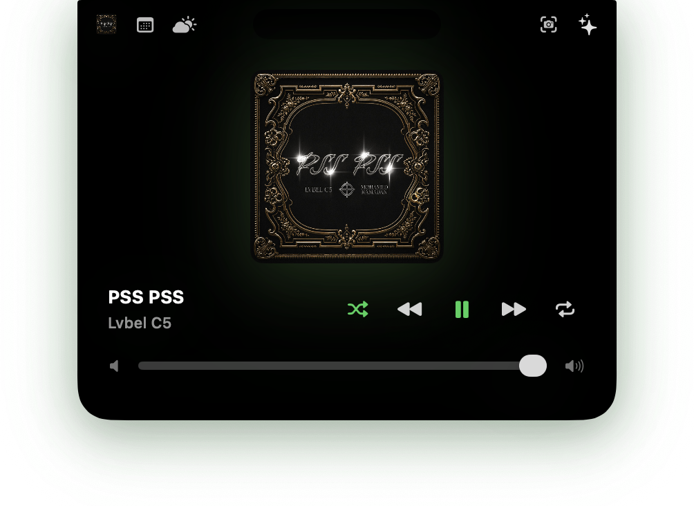

# NotchAgent

<p align="center">
  
</p>

<p align="center">
  
</p>

<p align="center">
  <b><a href="docs/screenshots.md">📸 View the full Screenshot Gallery here!</a></b>
</p>

NotchAgent is a local-first macOS notch companion that turns the top-center screen area into a compact control surface and a powerful AI Assistant.

The project is an evolving SwiftUI application. It currently features a dynamic notch window shell, multiple widget surfaces (Settings, Calendar, Camera Mirror, Music), and a fully functional AI Command Pipeline with voice recognition (Push-to-Talk) backed by local Ollama models or OpenAI.

## What's New in v1.2.0

- **Multi-step AI Command Execution:** The AI can now plan and execute multiple tasks in sequence (e.g., "Open Safari and type 'macOS tips'"). Includes fault tolerance that safely halts execution if a step fails.
- **Agent Eyes Animation:** A dynamic visual indicator mimicking "eyes" looking around during processing, bringing the Notch to life.
- **SwiftData Long-Term Memory:** 
  - **Facts Memory:** Automatically extracts personal preferences or facts from your voice commands and injects them into future prompts.
  - **Command Cache:** Remembers past executed commands and returns them instantly via a highly optimized local database.
- **Siri & AppIntents Integration:** You can now trigger the assistant globally by saying **"Hey Siri, Talk to Notch"** or **"Trigger Notch"** to bypass manual clicks.
- **Vision Capabilities:** Experimental screen capturing context for LLM processing.
- **Interactive Speech Feedback:** Enhanced voice feedback logic with sentence-by-sentence queueing and instant interruption when user starts speaking again.
- **Advanced Applescript Sandbox Evasion:** Natively types text, opens multi-tab browser URLs, and launches apps without relying on fragile AppleScript targets.

## Current Features

- Top-center notch panel with compact and expanded states
- Menu bar app with settings access
- Local settings stored with `UserDefaults`
- SwiftData-powered personal agent memory
- Global shortcut toggle for notch visibility
- Music surface with native Spotify and Apple Music playback controls
- Camera mirror surface with `AVCaptureSession`
- Calendar surface using EventKit permissions
- Weather surface placeholder
- **Voice-first AI Command Pipeline:**
  - Push-to-talk speech recognition
  - AppIntents/Siri Trigger Support
  - Optional whisper.cpp transcription for mixed Turkish/English commands
  - Local AI model processing via Ollama (`qwen2.5` or others)
  - OpenAI provider support
  - Fast SwiftData caching system for instant execution of previously learned commands
  - Natural language parsing to natively open apps and URLs (e.g., "open github.com")
  - Smart default music app tracking, Spotify/Apple Music search, and multi-turn conversational confirmation for ambiguous commands

## Planned

- Text command input as an alternative to voice
- Rule matcher for offline, non-LLM command routing
- Learned command aliases and custom workflows
- Richer GitHub, Cursor, and Mail integrations

## Requirements

- macOS 15.0+
- Xcode 15+
- SwiftUI / AppKit-capable macOS target

Some features require macOS permissions:
- **Camera:** For the mirror surface
- **Calendar:** For upcoming events
- **Automation / AppleEvents:** For Spotify and Apple Music controls
- **Screen Recording:** For Vision context understanding
- **Accessibility:** For typing text macros

### whisper.cpp transcription

The app uses Apple Speech by default. It can optionally use whisper.cpp instead for final voice command transcription. In Settings -> AI, set `Speech engine` to `Whisper.cpp` and choose a Whisper model file.

- `Whisper model path`: path to a ggml model such as `ggml-base.bin` or `ggml-small.bin`

NotchAgent expects `whisper-cli` to be available on the app process path. Homebrew installs from `brew install whisper-cpp` are supported without entering a custom binary path.

Homebrew does not download model files:

```sh
brew install whisper-cpp ffmpeg
```

After installing, download a `.bin` model from the whisper.cpp model links shown by `brew info whisper-cpp`, then select that model in Settings. While recording in Whisper mode, NotchAgent can still show live transcript updates; the final transcript is replaced by whisper.cpp after you stop speaking.

## Development

Open `NotchAgent.xcodeproj` in Xcode and run the `NotchAgent` scheme.

From the command line:

```sh
xcodebuild -project NotchAgent.xcodeproj -scheme NotchAgent -configuration Debug build
```

## Release Builds

Create a local Release build and DMG:

```sh
scripts/build_release.sh
```

The generated installer image is written to `dist/NotchAgent.dmg`.

Tagged releases are built by GitHub Actions when a tag like `v1.0.0` is pushed. Public releases should be signed and notarized with an Apple Developer ID before broad distribution.

NotchAgent checks `https://api.github.com/repos/omerfarukaras/NotchAgent/releases/latest` for updates. When a newer release is available, the app shows an update prompt and opens the GitHub release page.

This project is under active development. The notch shell and native system interactions are stabilizing, and the main focus is now on expanding the local, AI-powered agent capabilities and adding more app integrations.

## Author

Created by Omer Faruk Aras.

GitHub: [@omerfarukaras](https://github.com/omerfarukaras)

Repository: [omerfarukaras/NotchAgent](https://github.com/omerfarukaras/NotchAgent)

## Contributing

Contributions are welcome! If you'd like to help improve NotchAgent, please feel free to fork the repository, make your changes, and submit a pull request. 
Whether it's a bug fix, a new AI feature, or a UI enhancement, all contributions are appreciated.

## License

This project is licensed under the **Creative Commons Attribution-NonCommercial 4.0 International (CC BY-NC 4.0)** license.

You are free to download, use, and modify the source code for your own personal, non-commercial use. However, you may not sell, distribute commercially, or publish this software as a paid product. See the [LICENSE](LICENSE) file for more details.
